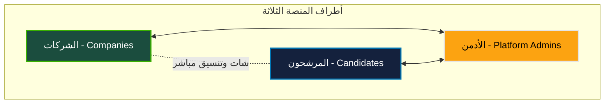
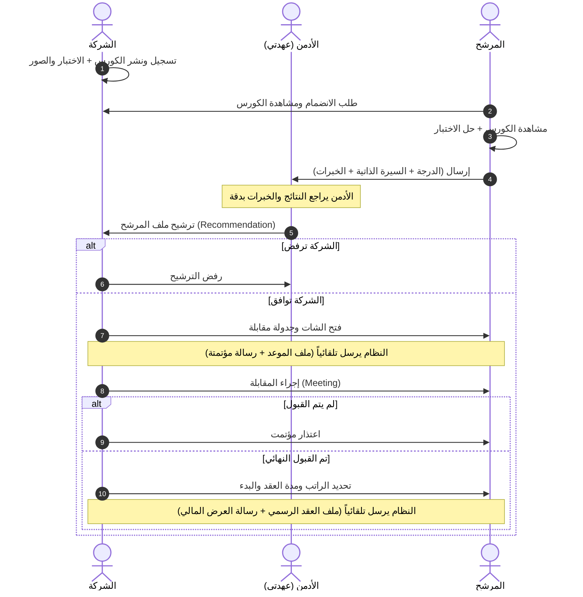

# دليل عمل وتصميم منصة عهدتي (Ahdati Platform Guide)

> [!NOTE]
> هذا الدليل تم إعداده خصيصاً لمساعدتك في فهم آلية عمل منصة **عهدتي** بالكامل، وتوفير تصور مرئي وتخطيطي واضح لتبنيه في الصفحة التوضيحية للمستخدمين، مع التركيز على جعل التصميم فخماً، تفاعلياً، ومتوافقاً مع الهوية السعودية الحديثة.

---

## 1. فلسفة عمل منصة "عهدتي"
منصة **عهدتي** ليست مجرد منصة توظيف تقليدية، بل هي **بيئة متكاملة للتدريب والتأهيل والتعهيد الخارجي (BPO)**. تقوم فكرتها الأساسية على ضمان كفاءة المرشح قبل وصوله للشركة عبر نظام **"التأهيل بالتدريب والاختبار"**، مما يقلل تكاليف التوظيف ويرفع جودة العمل عن بُعد.

### الأطراف الثلاثة الفاعلة في المنصة:


---

## 2. رحلة المستخدم التفصيلية (Step-by-Step User Journey)

### أولاً: رحلة الشركة (Employer Journey)
1. **التسجيل ونشر الكورس:** تقوم الشركة بإنشاء حساب رسمي، وتنشئ كورس تدريبي مخصص للمهارة المطلوبة (مثلاً: خدمة عملاء، إدخال بيانات، تسويق).
2. **إرفاق الاختبارات والتوضيحات:** ترفق الشركة مع الكورس اختبارات تقييمية (أسئلة اختيار من متعدد، أسئلة مقالية) وصور توضيحية لبيئة العمل.
3. **تلقي الترشيحات:** لا تتلقى الشركة مئات السير الذاتية العشوائية! بل تنتظر ترشيحات الأدمن الجاهزة.
4. **المقابلة (Meeting):** بمجرد قبول مرشح مقترح من الأدمن، يفتح نظام الشات التفاعلي، ويتم جدولة موعد المقابلة تلقائياً وإرسال **ملف موعد ورسالة مؤتمتة**.
5. **التوظيف والعقد:** في حال القبول بعد المقابلة، تحدد الشركة تفاصيل العقد (الراتب، مدة العقد)، ويقوم النظام بإنشاء **ملف عرض رسمي ورسالة عقد مؤتمتة**.

---

### ثانياً: رحلة المرشح (Candidate Journey)
1. **إنشاء الحساب والتقديم للتدريب:** يسجل المرشح حسابه الشخصي، ويتصفح الكورسات المتاحة من الشركات ويقدم طلب للانضمام إليها.
2. **مشاهدة الكورس والاختبار:** يشاهد المرشح المحتوى التعليمي للشركة بتركيز.
3. **حل الاختبار وإرفاق المستندات:** بعد إتمام الكورس، يحل المرشح الاختبار المرفق، ويرفق سيرته الذاتية (CV)، معرض أعماله، وخبراته السابقة.
4. **الانتظار ثم المقابلة:** ينتظر ترشيح الأدمن له. في حال تم ترشيحه ووافقت الشركة، يدخل الشات لتنسيق موعد المقابلة ويستلم ملف الموعد الرسمي.
5. **توقيع العقد المالي:** يستلم ملف العرض الرسمي والعقد المؤتمت ويبدأ العمل عن بعد براتب ومدة عقد محددين.

---

### ثالثاً: دور الأدمن (Admin / Platform Engine) - صمام الأمان
1. **فلترة المرشحين:** يراقب الأدمن لوحة التحكم لرؤية من أكمل الكورسات بنجاح وحصل على درجات عالية في الاختبارات.
2. **التدقيق المهني:** يراجع الأدمن السير الذاتية، الخبرات، وإجابات الاختبارات المرفقة للمرشحين المتفوقين.
3. **الترشيح الذكي:** يختار الأدمن أفضل المرشحين يدوياً ويقوم بعمل **"ترشيح (Recommend)"** لملفه وإرساله للشركة المعنية بناءً على التخصص والدقة.

---

## 3. مخطط سير العمل المتكامل (Comprehensive Workflow)



---

## 4. الهيكل المرئي والتخطيطي للصفحة التوضيحية (Interactive Landing Page Wireframe)
لتصميم صفحة ويب تفاعلية ومبهرة (Wow Factor) تشرح هذا العمل للمستخدمين الجدد، نقترح هذا الهيكل البصري الحديث:

### 1. قسم البداية (Hero Section)
* **العنوان الرئيسي:** "عهدتي.. مستقبل العمل والتدريب والتعهيد عن بُعد في المملكة"
* **العنوان الفرعي:** "منصة سعودية ذكية تربط الشركات بأفضل الكوادر البشرية المؤهلة والمختبرة مسبقاً لضمان كفاءة التشغيل."
* **الأزرار التفاعلية:** `ابدأ كشركة (كصاحب عمل)` | `انضم كمرشح (باحث عن تدريب وعمل)`
* **خلفية بصرية:** زجاجية تفاعلية (Glassmorphism) مع رسومات متحركة تمثل أجهزة لابتوب وعقود ذكية وشارات ترشيح ذهبية.

### 2. محاكي الرحلة التفاعلي (Interactive Journey Simulator)
* قسم يحتوي على ثلاثة تبويبات رئيسية يمكن للمستخدم النقر عليها ليتغير المحتوى والديناميكية أمامه:
  * **[تبويب الشركات]** -> يعرض كارت تفاعلي فيه زر "نشر كورس واختبار" ثم محاكاة استلام ترشيح من الأدمن مع شارة صح خضراء.
  * **[تبويب المرشحين]** -> يعرض كارت تفاعلي يوضح كتابة اختبار، إرفاق CV، ثم استلام "ملف موعد" ذهبي ولامع.
  * **[تبويب الأدمن]** -> يعرض لوحة تحكم مصغرة توضح سحب وإفلات المرشح المتميز لإرساله مباشرة للشركة.

### 3. قسم "كيف نضمن الكفاءة؟" (The Qualification Engine)
* بطاقات ثلاثية الأبعاد (3D Hover Cards) تشرح:
  1. **التعلم المتخصص:** محتوى تدريبي تقدمه الشركة ليفهم المرشح طبيعة العمل بدقة قبل أن يبدأ.
  2. **الاختبار الصارم:** اختبارات حقيقية تقيس الجاهزية والجدية.
  3. **الترشيح البشري/الذكي:** دور عهدتي في اختيار النخبة وتجنيب الشركات عناء الفلترة.

### 4. أداة توليد العقود والمواعيد المؤتمتة (Interactive Automation Preview)
* نافذة تحاكي الشات والمستندات الرسمية:
  * واجهة شات نظيفة وعصرية (بألوان خضراء ورمادية داكنة).
  * شكل **"ملف الموعد المؤتمت"** (كارت أنيق يحتوي على تاريخ المقابلة، رابط الاجتماع، وزر إضافة لتقويم Google).
  * شكل **"ملف العقد الرسمي"** (سند رقمي فخم يحتوي على الراتب الشهري، مدة العقد، وشعار منصة عهدتي مع توقيع إلكتروني).

---

## 5. الهوية البصرية المقترحة لتصميم الويب (Aesthetics & Theme)

لتحقيق **انطباع فخم وممتاز (Premium & Professional Arabic Look)**، نوصي بالتالي:

* **لوحة الألوان (Palette):**
  * **الأخضر الزمردي السعودي (Emerald Green):** `#1b4d3e` أو `#2a9d8f` (يمثل الثقة والنمو الوطني).
  * **الذهبي الملكي الخفيف (Muted Gold):** `#e9c46a` أو `#fca311` (يستخدم للملفات الرسمية، شارات الترشيح، والعقود الناجحة ليعطي شعوراً بالقيمة العالية).
  * **الخلفية الداكنة الفاخرة (Sleek Dark Slate):** `#121824` إلى `#1a2238` (لإبراز العناصر الجمالية والزجاجية بشكل مبهر للعين).
* **الخطوط (Typography):**
  * استخدام خط **Cairo** أو **Tajawal** أو **Outfit** (من Google Fonts) بحجم متناسق يعطي انسيابية رائعة للغة العربية.
* **التأثيرات الحركية (Micro-animations):**
  * تأثيرات حفر على الكروت (Card Hover Effects) لترتفع قليلاً مع إضاءة خفيفة (Glow).
  * حركة انسيابية سلسة (Smooth Transition) عند الانتقال بين خطوات الرحلة التوضيحية.

---

## 6. الهيكل التقني البرمجي المقترح لصفحتك (Developer Architecture)

بما أنك تبدأ بمشروع نظيف وفارغ، نقترح تنظيم الكود لبناء هذه الصفحة التوضيحية الممتازة كالتالي:

```
frontend/
├── src/
│   ├── components/
│   │   ├── HeroSection.jsx        # قسم البداية الجذاب
│   │   ├── JourneyTabs.jsx        # التبويبات التفاعلية (شركة/مرشح/أدمن)
│   │   ├── AutomationDemo.jsx     # محاكاة الشات والعقود التلقائية
│   │   └── FeaturesGrid.jsx       # مميزات وقيمة المنصة للشركات والمستثمرين
│   ├── assets/                    # صور وتوضيحات عالية الجودة
│   ├── aaap.jsx                   # الملف الرئيسي الحالي لتجميع المكونات
│   └── index.css                  # نظام التصميم والأنماط والألوان الفاخرة
```

> [!TIP]
> يركز هذا التصميم على طمأنة **المستثمر** بأن المنصة مبنية على كفاءة تقنية وتشغيلية ذكية ومؤتمتة بالكامل، مما يجعل تكاليف التشغيل الأولية منخفضة جداً والإنتاجية عالية للغاية!
